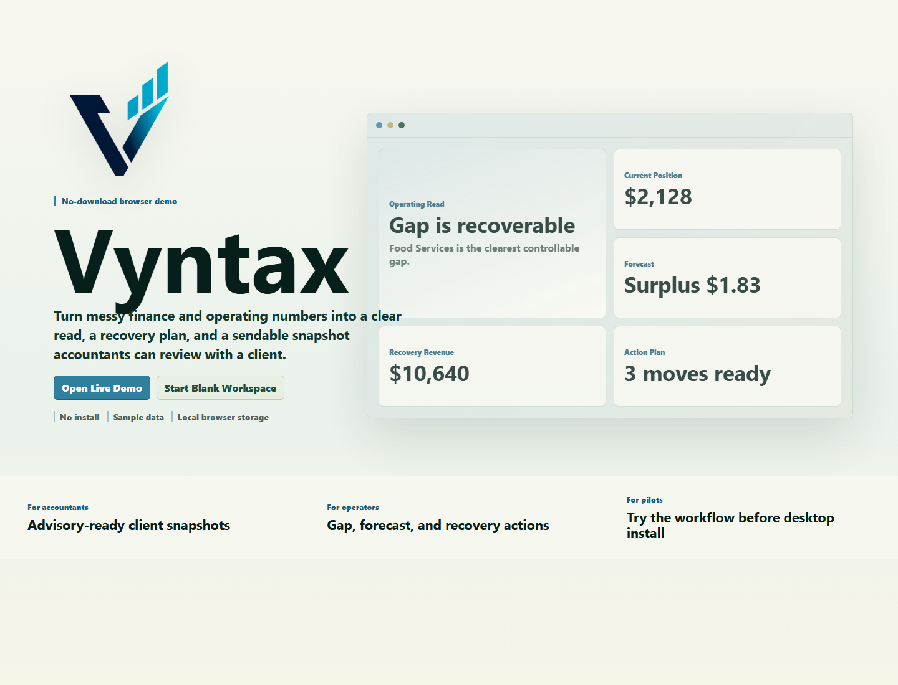
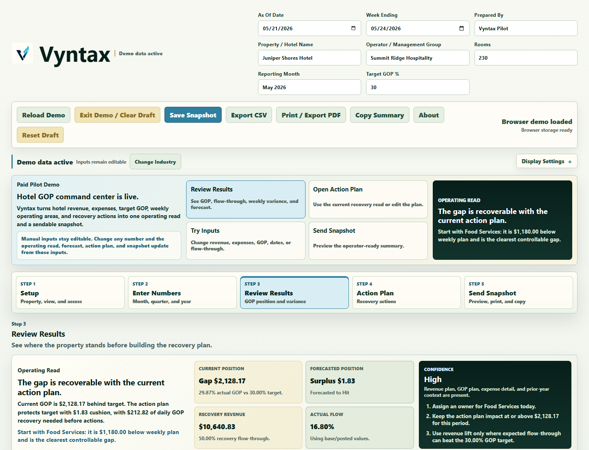

# VANTYX - Operations BI / GOP Recovery Tool

VANTYX is a local-first desktop and browser-demo tool for hotel and operations teams. It helps managers turn GOP performance data, forecasts, and operating gaps into clear recovery actions.

The project is an active prototype built to show operations-to-software product thinking: start with a real workflow, organize the data, identify the gap, and produce a practical next-action view.

## Demo Video

[Watch the VANTYX demo walkthrough](https://youtu.be/jwtubXtU6mY)





## Status

Active prototype / portfolio project.

This public repo contains source code and sample/demo workflow assets only. It does not include private credentials, client data, production hotel data, installer builds, or local machine artifacts.

## What It Does

- Month, quarter, and year GOP performance dashboards.
- Weekly control views and period tracking.
- Manual projections and editable operator inputs.
- Gap detection against target GOP.
- Recovery action logic that converts variance into specific next steps.
- Local save/autosave behavior.
- CSV export.
- Print / PDF-style reporting view through the browser/system print flow.
- Tauri desktop shell with React and TypeScript UI.

## Stack

- React
- TypeScript
- Vite
- Tauri v2
- Rust basics for the desktop shell
- Local browser/Tauri persistence
- Vitest

## My Role

I defined the product requirements, workflow logic, dashboard structure, UX direction, acceptance criteria, testing goals, and system behavior. I used AI coding tools to accelerate implementation, while keeping responsibility for product framing, data flow, and practical operations logic.

## Run Locally

```powershell
npm install
npm run dev
```

Open the local URL printed by Vite. Use the browser demo route or demo controls to load sample data.

## Test

```powershell
npm test
npm run build
```

## Desktop Development

Tauri development requires Rust and the Tauri prerequisites for your system.

```powershell
npm run tauri:dev
```

## Current Limitations

- This is not a deployed enterprise product.
- Live hotel/accounting integrations are not included.
- Demo mode uses sample data.
- Plan Assist access is optional and local; no real access file is included in this repo.
- Reporting export uses browser/system print behavior.

## Security / Privacy

See [SECURITY_NOTES.md](SECURITY_NOTES.md). This repo is intended to be public-safe and should not contain production data, credentials, private pilot files, generated installers, local caches, or build outputs.
